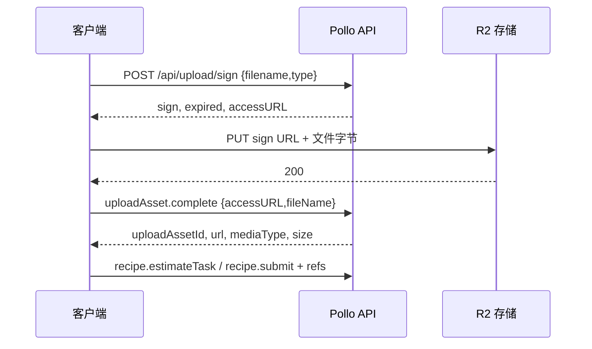

# Pollo.ai / pol2api 协议研究记录

研究日期：2026-09-18。依据用户手动操作期间的原生 CDP 网络记录；未重放注册、积分或生成请求。浏览器保留，监听已停止。

## 证据范围与结论

本轮覆盖邮箱验证码注册、密码登录、退出、Google OAuth 登录、账户积分查询、模型配置、素材上传、报价、一次视频任务提交及成功结果查询。

- 监听时间：2026-09-18 11:16:53–11:47:25，Asia/Taipei。
- 27,462 条事件，5,138 次请求事件，5,074 次响应事件，3,536 条响应体记录；响应体按内容去重后 1,047 个文件。
- 关联得到 5,108 个请求记录；重定向复用 requestId，故数量小于请求事件数。
- 拆分 tRPC batch 后识别 51 个 procedure，24 次报价、11 种报价样本、1 次生成提交、38 次状态查询。
- 邮箱新账户注册和登录成功，查询到的积分为 0。Google 登录的是既有账户，登录后总积分 22、已用 8、可用 14；本轮没有观察到 Google 新账户注册或积分发放。
- 实测成功：Seedance 2.0 Mini，480p、4 秒、16:9、4 图 + 2 音频 + 2 视频，扣除 12 积分，可用余额 14 → 2。
- 获取到 Seedance 2.0 标准、Fast、Mini 和 2.5 的服务端 manifest。标准模型的分辨率枚举含 `4K`；属于配置证据，尚未生成验证。

证据定位使用本轮 `events.jsonl` 的行号，例如 `E26319`。同一 batch 的多个 procedure 共用请求行，应结合 `protocol-evidence.json` 中的 `batch_index`、响应体行号和 SHA-256 查阅。

## 本地原始记录与脱敏交付

原始记录：`D:\workspace_ai\overseas_ai\any-auto-register\output\cdp\pol-01\20260918-111653-network`。

本目录文件：

- `protocol-evidence.json`：账户积分、报价、生成结果及证据定位。
- `pricing-observed.csv`：11 种实际报价样本，附请求行号。
- `model-capabilities.json`：11 份去重后的模型配置摘要、素材限制和条件规则。
- `endpoint-catalog.json`：51 个 tRPC procedure 的字段、次数和证据索引。
- `request-example.json`：使用虚构素材地址、名称、提示词和项目标识的提交结构示例。

原始 Cookie、密码、验证码、OAuth 参数、签名上传 URL、账户标识、用户提示词及素材地址仅留在本地 Git 忽略目录。本目录没有这些原始值。

## 传输协议与会话

业务 API 主要位于 `https://pollo.ai/api/trpc/`。实际请求采用 Cookie 会话，观察到 `__Secure-next-auth.session-token`；CSRF 使用 `__Host-next-auth.csrf-token`，OAuth 还涉及 callback、state、PKCE Cookie。不要将本轮完整 Cookie 字符串写入公共代码。

业务请求带 `x-recipe-protocol: 1`、`user-language`；POST 为 `application/json`。这些是观察到的请求配置，尚未逐个删减验证最小必需头。没有发现业务 API 使用独立 Bearer key 的证据。

batch 请求示意：

```text
GET /api/trpc/subUsage.getSubUsage?batch=1&input=<URL 编码的 JSON>
input = {"0":{"json":{"appName":"Pollo"}}}

POST /api/trpc/recipe.estimateTask?batch=1
body = {"0":{"json":{...业务参数...}}}

response = [{"result":{"data":{"json":...}}}]
```

非 batch 请求也存在，例如 `user.sendRegisterEmailCode` 使用 `{"json":{"email":"<email>"}}`。同一批次以 URL procedure 顺序和数字索引对应响应。保留序列化层的 `meta` 信息；集成时同时检查 HTTP 状态及 tRPC `error`，不能只判断 HTTP 200。

NextAuth 登录接口使用 `application/x-www-form-urlencoded`，不是上述 tRPC JSON。

## 注册、登录与积分

### 邮箱注册与密码登录：已实测

| 顺序 | 接口 | 关键参数/结果 | 证据 |
|---|---|---|---|
| 1 | `user.sendRegisterEmailCode` | `email`；请求头携带 `recaptcha-token`；返回 success | E506 |
| 2 | `user.verifyRegisterEmailCode` | `email, code`；返回 success | E655 |
| 3 | `user.createUserByVerifiedEmail` | `email, code, firstName, lastName, password, timeZone`；返回已创建用户 | E799 |
| 4 | `GET /api/auth/csrf` | 获取 csrfToken | E994 |
| 5 | `POST /api/auth/callback/system-user` | `email, password, deviceNumber, version=v1, redirect=false, csrfToken, callbackUrl, json=true` | E1001 |
| 6 | `GET /api/auth/session` | 确认登录用户、expires | E1008 |
| 7 | `subUsage.getSubUsage` | `appName=Pollo`；积分各项为 0 | E1048 |

发送验证码前记录到 reCAPTCHA 的 reload、payload、userverify 请求（E364、E444、E495）；发送邮件时带对应验证 token。验证码有效期、重发间隔及错误次数上限没有足够证据。

`deviceNumber` 与 `version=v1` 是实际登录参数。捕获的客户端脚本包含 `sigV1`，其实现依赖其他模块；本轮未复现计算或验证纯 HTTP 密码登录，不应把已捕获的 deviceNumber 当作通用常量。

### Google OAuth：已有账户登录已实测

顺序为 `/api/auth/signout` → 匿名会话 → `/api/auth/signin/google` → Google 授权 → `/api/auth/callback/google` → `/sign-in-google` → `/api/auth/session`。

证据：退出 E18245、匿名 callback E18583、Google signin E19047、OAuth callback 重定向 E19683、已登录 session E20001。OAuth 请求包含 state/PKCE 相关 Cookie，回调包含 code/state；集成应延续同一授权会话。

Google session 对应账户创建于本次监听之前，且已有积分消耗记录。因此本轮只证明已有 Google 账户可以登录并生成视频，不能证明 Google 登录或注册必然发放积分。

### 积分与签到：已确认查询，未捕获领取成功

| 接口 | 本轮结果 | 集成含义 |
|---|---|---|
| `subUsage.getSubUsage` | 新邮箱账户 0；既有 Google 账户 22 总额、8 已用，后变 20 已用 | 本轮余额 = totalCount − useCount；不要重复相加 usageList 与 rewardUsage |
| `user.getNewUserFreeCredits` | `{credits:20}`，E18597 | 展示/配置查询，不是发放记录 |
| `signIn.canSignIn` | `{canSignIn:true, showCheckInEntry:true}`，E1156、E20302 | 查询参数 `appName=Pollo, timezone=-8`；可签到不等于已签到 |
| `incentive.checkIncentiveReceived` | `{received:false}` | 没有成功领取证据 |
| `user.getCreditsNotification` | `{show:false, reason:5104}` | reason 的业务含义未确认，不能直接归因为风控封禁 |
| `reward.rewarded` / `reward.rewardRecords` | 注册/订阅奖励计数 0、记录空 | 不应当作通用领取入口 |

本轮没有捕获积分领取 mutation 或签到成功响应。后续 any-auto-register 应把“注册成功”“会话可用”“积分到账”“允许同步到下游”作为独立状态；不能以登录成功代替积分到账。

## 素材上传与提示词引用

上传链路已观察到 6 次完整执行：1 张图片、3 个视频、2 个音频。生成所用其余图片来自已有素材。



签名 URL 使用 S3 风格参数，本轮 `X-Amz-Expires=1200`；过期后应重新获取。上传后业务素材地址位于 `videocdn.pollo.ai`。`uploadAsset.complete` 返回的 width/height/duration 等字段在本轮均可能为 null，提交所需媒体元数据不能假定总由该接口提供，应在客户端解析并校验。证据：E23075/E23093/E23113，以及后续同类请求。

`userInput.refs[]` 的格式是：

```json
{
  "type": "video",
  "name": "video_1",
  "video": "<上传后的素材 URL>",
  "order": 5,
  "metadata": {"duration": 2, "width": 1280, "height": 1280}
}
```

图片使用 `image` 字段，音频使用 `audio` 字段。提示词引用为 `[@video_1]`，其中名称必须对应 `refs[].name`。E26319 的所有 8 个引用均能匹配素材名称。

本轮 refs 顺序为音频、图片、视频；`order` 出现重复值，说明不能拿它作为跨媒体唯一编号。`filename`、显示名称和 order 也不能互相替代。

后续归一化建议：按调用者提供的各媒体类型顺序建立别名表，把 `视频1 / video1 / v1 / 视1`、`图片1 / 图1 / img1 / Image1`、`Audio1 / 音频1` 映射到对应素材的实际 name，再输出 `[@name]`。处理大小写、边界、已有 `[@name]`、名称冲突和越界引用；不要只替换字面前缀，也不要套用其他平台的 `Image 1` 格式。此处是实现设计，尚未写入业务代码或验证新建名称策略。

## 模型与参数能力

能力来自 `recipe.models`、`recipe.manifest {recipeCode,model}`；报价和提交则使用顶层 `modelKey`，同时发送 `userInput.model`。manifest 的 `properties.model.default` 可继承 recipe 基础模型，必须显式填入所选模型，避免静默切换。

| modelKey | 分辨率枚举 | 输出时长 | 图片/音频/视频上限 | 总素材上限 | 证据 |
|---|---|---|---|---|---|
| `seedance-2-0` | 480p / 720p / 1080p / **4K** | 4–15 秒 | 9 / 3 / 3 | 15 | E21545 |
| `seedance-2-0-fast` | 480p / 720p | 4–15 秒 | 9 / 3 / 3 | 15 | E21915 |
| `seedance-2-0-mini` | 480p / 720p | 4–15 秒 | 9 / 3 / 3 | 15 | E22222 |
| `seedance-2-5` | 480p / 720p / 1080p | 4–30 秒 | 30 / 10 / 10 | 50 | E21476 |

2.0 系列画幅：16:9、4:3、1:1、3:4、9:16、21:9。2.5 另有 `adaptive`。这些 manifest 的分辨率默认均为 480p；此前要求无分辨率别名默认 720p，网关需要显式覆盖上游默认值。

共同限制包括：prompt 最大 10,000 字符、输出数量 1–4、seed 0–2,147,483,647。只提供音频的 refs 被 manifest 条件规则判为无有效视觉素材。多输出和限制边界尚未实测。

素材约束摘要：

- 2.0 图片最大 30 MiB；视频最大 50 MiB、单段至少 2 秒、总时长至多 15.2 秒；音频最大 15 MiB、单段至少 2 秒、总时长至多 15 秒。
- 2.5 图片最大 30 MiB；视频最大 200 MiB、总时长至多 30.2 秒；音频单文件最大 15 MiB、总大小 64 MiB、总时长至多 30 秒。
- 视频还有像素总数、画幅和部分模型的帧率限制；完整值见 `model-capabilities.json`。配置观察不等于服务端全部边界均已验证。

沿用此前提出的外部命名时，可采用以下候选映射；它们目前是设计记录：

| 对外模型名 | modelKey | resolution |
|---|---|---|
| `sd-2-0` | `seedance-2-0` | `720p` |
| `sd-2-0-1080p` | `seedance-2-0` | `1080p` |
| `sd-2-0-4k` | `seedance-2-0` | `4K` |
| `sd-2-0-fast` | `seedance-2-0-fast` | `720p` |
| `sd-2-0-mini` | `seedance-2-0-mini` | `720p` |
| `sd-2-0-fast-480p` | `seedance-2-0-fast` | `480p` |
| `sd-2-5` | `seedance-2-5` | `720p` |
| `sd-2-5-480p` | `seedance-2-5` | `480p` |
| `sd-2-5-1080p` | `seedance-2-5` | `1080p` |

## 报价与实际扣费

`recipe.estimateTask` 接收与生成相同的 `recipeCode, modelKey, userInput, numOutputs, entitlement`。本轮 `entitlement={unlimited:false}`。返回 `singleCost, cost, discountSingleCost, discountCost, numOutputs, entitlementSource`。

全部下列样本为单输出、16:9、开启音频；除注明外均为 480p。

| 模型/输出秒数 | 参考素材 | 原价 → 折后 | 证据 |
|---|---|---|---|
| Pollo 2.5 / 5 秒 / 720p basic | 无 refs | 12 → 12 | E1171 |
| Pollo 3.0 / 5 秒 / basic | 无 refs | 10 → 10 | E21397 |
| Seedance 2.0 标准 / 5 秒 | 无 refs | 50 → 20 | E21644 |
| Seedance 2.0 Mini / 5 秒 | 无 refs | 25 → 10 | E22297 |
| Mini / 4 秒 | 无 refs，或 4 图 | 20 → 8 | E22369、E22877 |
| Mini / 4 秒 | 4 图 + 10 秒视频；添加 2 音频后相同 | 39 → 15 | E24201、E24786 |
| Mini / 4 秒 | 4 图 + 2 音频 + 视频 10 秒及 2 秒 | 45 → 18 | E25084 |
| Mini / 4 秒 | 4 图 + 2 音频 + 2 秒视频 | 17 → 6 | E25175 |
| Mini / 4 秒 | 4 图 + 2 音频 + 视频 2 秒及 5.088 秒 | 31 → 12 | E25513 |

Seedance 样本的 `entitlementSource=promotion_discount`。本轮不能推导固定单价：参考视频时长改变报价，且加入短视频时价格可以低于无视频样本。集成应在素材与元数据确定后请求实时报价，并保留原价、折后价、权益来源；不要把此表或折扣永久硬编码。

实际提交使用最后一项，任务详情 `creditDecimal="12", creditType="reward"`，同时账户 useCount 从 8 变 20；两处证据一致（E26336、E27179、E27192）。未捕获 Fast、2.5、高分辨率、批量输出的实际报价或扣费。

## 视频任务提交、轮询与结果

提交：`POST /api/trpc/recipe.submit?batch=1`，结构见 `request-example.json`。本轮需要的业务字段为 `recipeCode=ref2video, modelKey, userInput, numOutputs, entitlement, projectId`。projectId 来自当前账户的项目列表；本轮没有项目创建接口证据。

本轮提交配置还包含 `published=true, protectionMode=false`；这涉及作品公开/保护选项，应在后续产品设计中明确处理。manifest 对这些选项包含付费条件，不能假定免费账户可任意切换。

提交返回数值型记录 `id`、`status=waiting`、`requestLimit=false`（E26319）。记录 id 与作品 videoId 是不同标识：

- `generationPolling.fetchRecordsStatus {recordIds:[数值记录id]}`：查询 waiting/processing/succeed，等待时返回 waitingIndex/waitingCount，作品列表含字符串 videoId。
- `generation.queryRecordDetail {id:数值记录id}`：详情及结果，含 generateRecord、generations、mediaUrl/videoUrl、错误和退款字段。
- `video.getVideoDetail {videoId:字符串作品id}`：作品详情；不要把两类 id 混用。

已观察状态：11:39:03 waiting → 11:39:54 processing → 11:42:16 succeed。首次队列信息为 waitingIndex=280、waitingCount=281。这只是一条任务的等待情况，不代表服务时限。

成功结果（E27179）：864×496、4.096 秒、有音轨；不是按请求 16:9 算出的精确 480 行画面。`videoUrl`、`mediaUrl`、`previewUrl` 本轮相同，均为 CDN 地址；`videoUrlNoWatermark` 未提供可用值。应返回上游实际元数据，不能从模型名虚构尺寸或无水印权限。

观察到 `push.issueConnectToken` 与 WebSocket 通信，可作为后续研究项；当前已验证的任务跟踪链路使用 HTTP 轮询。失败、退款、取消、限流及超时场景尚未实测，不能把本轮 `failCode=-1` 当作失败状态。

## 风控与证据缺口

已直接观察：验证码邮件发送携带 reCAPTCHA token；密码登录携带 deviceNumber/version；OAuth 使用 CSRF/state/PKCE；业务请求延续会话 Cookie；模型 manifest 有媒体边界、素材组合和会员条件。

本轮业务响应没有观察到 HTTP 4xx/5xx 或 tRPC error。日志中有 411 条 Network.loadingFailed 事件，已关联的失败多数是 `net::ERR_ABORTED`；这类页面切换/请求取消不能直接归为封禁。另有 83 次响应体读取不可用和 4 次 target 断开，关键注册、报价、提交、成功结果的响应体均有记录。

以下事项保持未确认：

1. 邮箱新账户无积分的具体原因；5104 含义；新 Google 账户的发放条件；积分领取 mutation 及签到闭环。
2. deviceNumber/sigV1 的完整计算和有效期、仅靠 HTTP 的注册/登录可行性、会话续期规则、最小 Cookie/请求头集合。
3. 标准 1080p/4K、Fast、Mini 720p、2.5 多分辨率的生成和计费验证。
4. 每模型计费公式、活动变更、会员权益、限流和并发上限、失败退款、取消任务、媒体链接寿命。
5. 同名素材、提示词引用边界、素材数量上限、多输出和无视觉素材的实际错误响应。

本轮只监听和离线分析，没有为补证据新增耗费积分的操作。

## 后续集成分工建议

`any-auto-register`：邮箱验证码流程、授权登录会话、账户积分状态、满足条件后同步下游。Google 登录使用用户授权流程；积分领取接口应在获得真实请求证据后实现。

`pol2api`：会话账户池、tRPC 编解码、动态 manifest/报价、素材上传与元数据校验、提示词引用归一化、模型别名、任务 id 映射及轮询结果。首次连接应验证账户、项目与余额，不能直接采用示例中的占位值。

以上是监听结束时的研究快照。后续已按要求实现 pol2api 的任务提交、查询、外部 API、账号池与控制台；积分领取仍暂不接入。实现范围与验证边界见 [实现验证记录](../implementation-verification.md)，启动及接口用法见 [README](../../README.md)。
